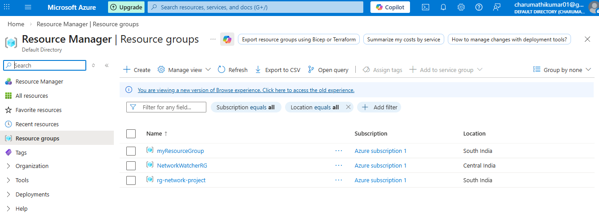
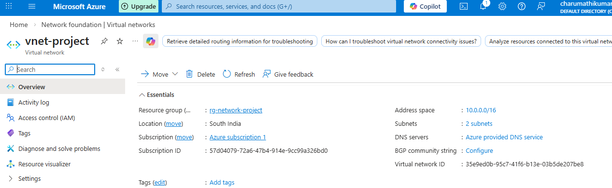
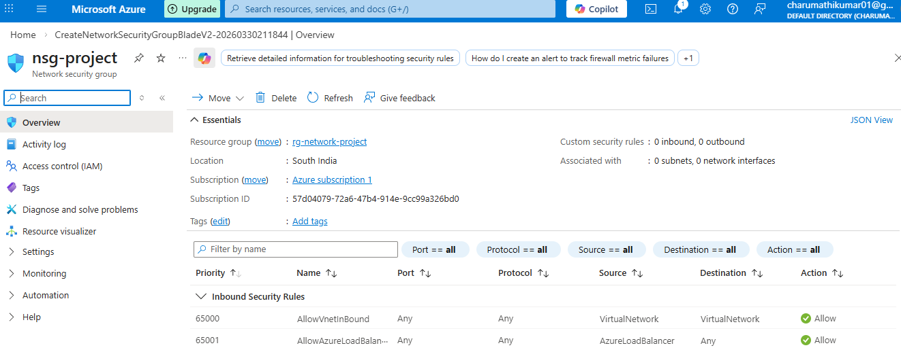
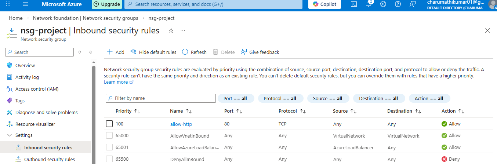
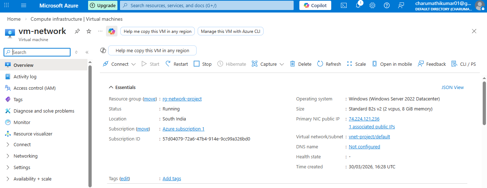
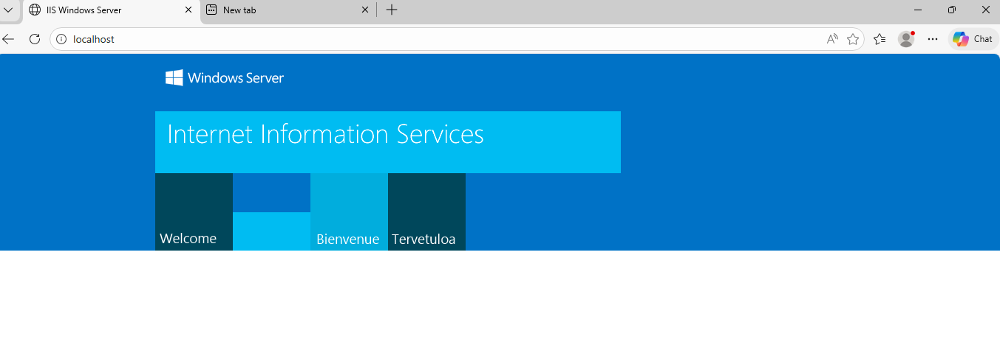

# Azure Virtual Network and NSG Configuration Project

## Project Overview

This project demonstrates the creation and configuration of Azure Virtual Network,Network Security Group,and Virtual Machines with IIS Web Server

The objective of this project is to understand Azure networking, subnet configuration, NSG rules and public access to a virtual machine.

## Services Used

Azure Virtual Network
Azure Subnet
Network Security Group(NSG)
Azure Virtual Machine
Windows Server
IIS Web Server
Public IP
RDP

## Architecture

Virtual Network->Subnet->Network Security Group->Virtual Machine->IIS Web Server->Public IP Access

## Step Performed

## 1. Created Resource Group

Created a resource group to manage networking resources

## 2. Created Virtual Network

Address Space: 10.0.0.0/16
Subnet       : 10.0.1.0/24

## 3.Created Network Security Group

Added HTTP rule (Port80)
Added RDP rule (Port 3389)

## 4.Created Virtual Machine

Windows Server
Standard SSD Disk
Attached NSG and Vnet
Public IP created

## 5.Connected to VM

Used RDP to connect to Windows Server

## 6. Installed IIS

Installed Web Server (IIS)
Verified using localhost

## 7.Tested Public IP

Accessed IIS page using public IP in browser

## Screenshots

## Resource Group

## Virtual Network

## NSG

## NSG Rules

## Virtual Machine

## IIS Server

## Outcome

Successfully configured Azure Virtual Network and Network Security Group to allow HTTP and RDP traffic and deployed IIS Web Server on Azure Virtual Machine.

## Author

Charumathi Kumar

